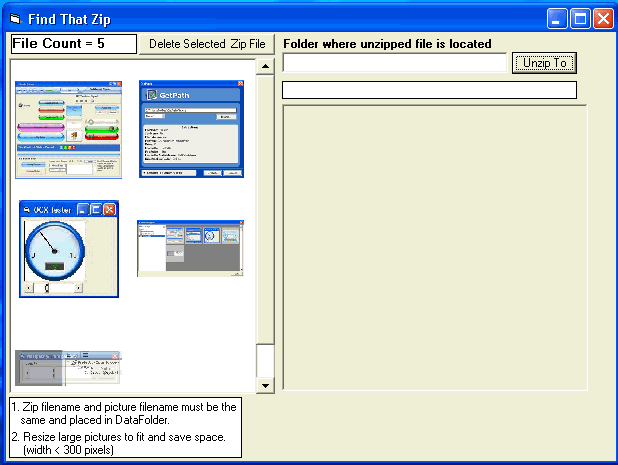



## Find That Zip

### Description

Sometimes I can't remember the name of the zip, but I know what the form looks like. This is really a simple interface for others code found here on PSC.Wish I could take the credit, but can't.Maybe it will spark someone to make a slicker, more efficent program. I chose this method because I can change the zip with a newer version easier.Oh, you can unzip the file to a folder of your choice.
 
### More Info
 

             |
---                |---
**Submitted On**   |2007-02-04 16:57:12
**By**             |[Kenneth Foster](https://github.com/Planet-Source-Code/PSCIndex/blob/master/ByAuthor/kenneth-foster.md)
**Level**          |Intermediate
**User Rating**    |5.0 (10 globes from 2 users)
**Compatibility**  |VB 6\.0
**Category**       |[Complete Applications](https://github.com/Planet-Source-Code/PSCIndex/blob/master/ByCategory/complete-applications__1-27.md)
**World**          |[Visual Basic](https://github.com/Planet-Source-Code/PSCIndex/blob/master/ByWorld/visual-basic.md)
**Archive File**   |[Find\_That\_204628242007\.zip](https://github.com/Planet-Source-Code/kenneth-foster-find-that-zip__1-67790/archive/master.zip)

